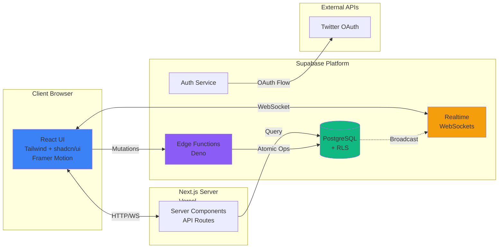
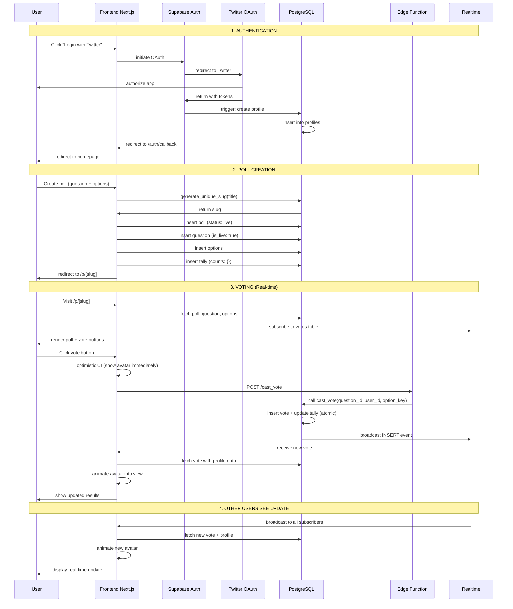
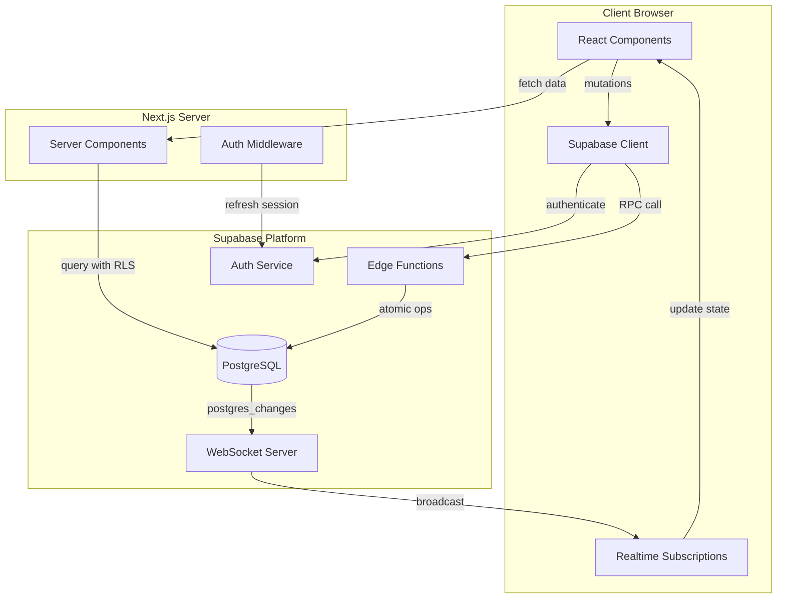
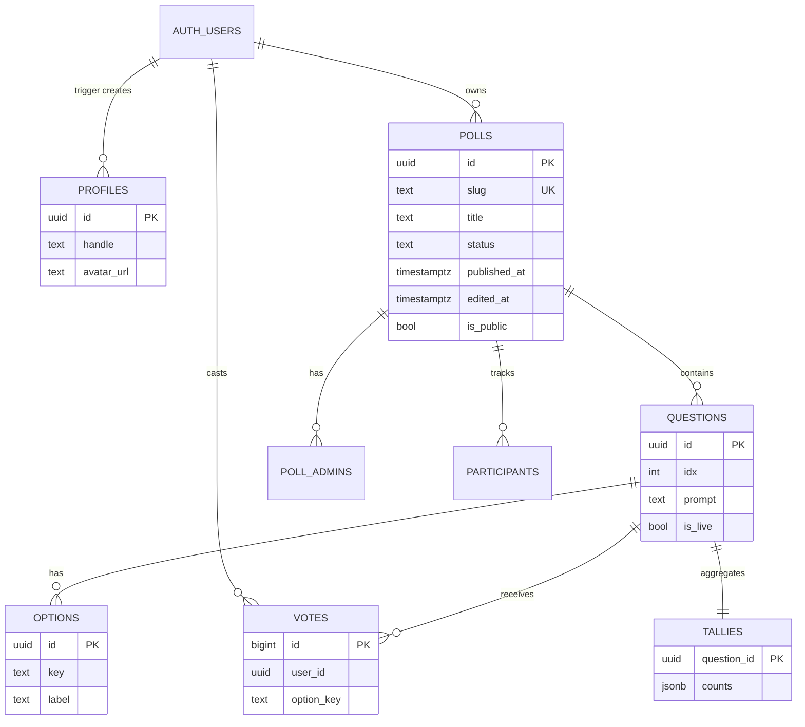

# Polls App 🗳️

**Production-ready multi-tenant real-time polling application** for mapping opinions & beliefs across communities.

Built for live events, presentations, and egregoric analysis. Login with Twitter, create polls, vote in real-time, and watch results update instantly with animated avatars.

---

## ✨ Features

### 🔐 Authentication & Identity
- **Twitter OAuth** - Seamless login with automatic profile sync
- **Auto-profile creation** - Handle and avatar pulled from Twitter on signup

### 📝 Poll Management
- **Twitter-Style Polls** - Simple single-question format with custom answers (min 2, no max)
- **Draft/Publish Flow** - Save as draft or publish live immediately
- **Edit Tracking** - Update polls after publishing (shows "edited" badge)
- **Poll Lifecycle** - Draft → Live → Closed workflow
- **URL-friendly slugs** - Human-readable shareable links

### 👤 Visual Voting Experience
- **Real-time Avatar Display** - See WHO voted for WHAT with profile pictures
- **Animated Transitions** - Smooth Framer Motion animations as votes come in
- **Compact/Expanded Views** - Toggle between avatars-only or avatars + handles
- **Optimistic UI** - Instant feedback before server confirmation
- **One-vote-per-question** - Enforced at database level

### 🎯 Multi-tenant Architecture
- **Anyone can create polls** - Full self-service poll creation
- **Public/Private Polls** - Control visibility
- **Admin Panel** - Manage poll lifecycle and edits
- **Discovery Feed** - Browse all live public polls

### 📊 Real-time Everything
- **Live vote updates** - WebSocket subscriptions via Supabase Realtime
- **Active participant wall** - See who's currently viewing
- **Instant result updates** - No page refresh needed

---

## 🏗️ Architecture

### Tech Stack



**Frontend:**
- Next.js 14 with App Router (React Server Components + Client Components)
- TypeScript for type safety
- Tailwind CSS + shadcn/ui for styling
- Framer Motion for animations
- Supabase JS Client for data fetching and real-time subscriptions

**Backend:**
- Supabase PostgreSQL with Row-Level Security (RLS)
- Supabase Auth for Twitter OAuth
- Supabase Realtime for WebSocket subscriptions
- Edge Functions (Deno) for atomic operations

**Deployment:**
- Frontend: Vercel (automatic deployments)
- Backend: Supabase Cloud (managed PostgreSQL)

---

## 🔄 Application Flow

### Complete User Journey



### Data Flow Architecture



### Database Schema & RLS



---

## 🚀 Quick Start

### Prerequisites
- Node.js 18+ installed
- Supabase account (free tier works)
- Twitter Developer account (for OAuth)

### 1. Clone & Install

```bash
git clone https://github.com/your-username/polls-app.git
cd polls-app
npm install
```

### 2. Set Up Supabase

See **[SETUP.md](./SETUP.md)** for complete instructions including:
- Database migrations (7 SQL files)
- Realtime configuration
- Edge Functions deployment
- Twitter OAuth setup

### 3. Configure Environment

```bash
cp env.example .env.local
```

Edit `.env.local` with your Supabase credentials:
```bash
NEXT_PUBLIC_SUPABASE_URL=https://your-project.supabase.co
NEXT_PUBLIC_SUPABASE_ANON_KEY=your-anon-key
SUPABASE_SERVICE_ROLE_KEY=your-service-role-key
```

### 4. Run Locally

```bash
npm run dev
```

Visit [http://localhost:3000](http://localhost:3000)

### 5. Deploy to Production

```bash
# Deploy to Vercel
vercel --prod

# Or use the Vercel dashboard
# Add environment variables in project settings
```

**Don't forget:** Update Twitter OAuth callback URLs and Supabase redirect URLs for your production domain!

---

## 📋 Usage

### For Poll Creators

1. **Login** with Twitter
2. Click **"Create Poll"** 
3. Enter your question and at least 2 answer options
4. Choose **"Publish Now"** (goes live) or **"Save as Draft"**
5. Share the URL: `yoursite.com/p/your-poll-slug`
6. Watch votes come in real-time! 🎉

### For Voters

1. Visit a poll URL (from discovery or shared link)
2. Click your answer
3. Watch your avatar appear under your choice
4. See everyone else's votes in real-time
5. Toggle compact/expanded view to see voter handles

### Managing Polls

- **My Polls** - View all your polls (drafts, live, closed)
- **Admin Panel** - Edit, publish, or close your polls
- **Edit Tracking** - Polls show "edited" badge when modified

---

## 🎯 Use Cases

### Egregoric Analysis
Map collective consciousness by finding consensus boundaries:
1. Ask questions to identify **universal agreement**
2. Ask questions to identify **polarizing topics**
3. Subdivide and explore belief distributions

### Live Events
- **Conference Q&A** - Gauge audience opinions instantly
- **Workshop Feedback** - Real-time sentiment analysis
- **Symposium Discussions** - Visualize participant positions
- **Community Decisions** - Democratic polling with transparency

### Research & Analysis
- **Opinion Mapping** - See voting patterns by identity
- **A/B Testing** - Quick user preference surveys
- **Market Research** - Visual demographic breakdowns

---

## 🔐 Security & Privacy

### Row-Level Security (RLS)
All database tables use PostgreSQL RLS policies:
- ✅ **Votes are publicly visible** (transparency by design)
- ✅ Only authenticated users can vote
- ✅ One vote per user per question (enforced at DB level)
- ✅ Draft polls only visible to owner/admins
- ✅ Only owners can edit/publish/close their polls

### Authentication
- Twitter OAuth via Supabase Auth
- Automatic profile creation with triggers
- Session management with HTTP-only cookies
- No passwords stored locally

### Data Protection
- Environment variables for secrets
- Service role keys server-side only
- HTTPS everywhere in production
- SQL injection prevention via parameterized queries

---

## 🛠️ Development

### Project Structure

```
polls-app/
├── src/
│   ├── app/                    # Next.js App Router pages
│   │   ├── page.tsx           # Discovery feed
│   │   ├── new/               # Poll creation
│   │   ├── my-polls/          # User's poll management
│   │   └── p/[slug]/          # Poll view & admin
│   ├── components/            # React components
│   │   ├── ui/               # shadcn/ui components
│   │   ├── VoteButtons.tsx   # Voting interface
│   │   ├── LiveResults.tsx   # Real-time results display
│   │   └── VoterAvatars.tsx  # Animated avatar grid
│   ├── hooks/                # Custom React hooks
│   │   ├── useRealtime.ts   # Realtime subscriptions
│   │   └── useVotes.ts      # Vote data & real-time
│   └── lib/                  # Utilities & clients
│       ├── supabase/        # Supabase client configs
│       └── types.ts         # TypeScript definitions
├── supabase/
│   ├── migrations/           # Database migrations (1-7)
│   └── functions/            # Edge Functions (Deno)
│       ├── cast_vote/       # Atomic vote insertion
│       ├── advance_question/# Question lifecycle
│       └── close_question/  # Close voting
└── public/                   # Static assets
```

### Key Technologies

- **Next.js 14** - React framework with App Router
- **TypeScript** - Type safety throughout
- **Tailwind CSS** - Utility-first styling
- **shadcn/ui** - Accessible component library
- **Framer Motion** - Animation library
- **Supabase** - Backend-as-a-Service
- **PostgreSQL** - Relational database
- **Vercel** - Hosting & deployment

### Local Development Commands

```bash
npm run dev        # Start dev server (localhost:3000)
npm run build      # Build for production
npm run start      # Run production build locally
npm run lint       # Run ESLint
npm run type-check # TypeScript validation
```

---

## 📚 Documentation

- **[SETUP.md](./SETUP.md)** - Complete setup guide with step-by-step instructions
- **[Database Migrations](./supabase/migrations/)** - SQL schema, RLS policies, functions & triggers
- **[Edge Functions](./supabase/functions/)** - Serverless Deno functions for atomic operations

---

## 🤝 Contributing

This is an open-source project by [Open Research Institute](https://github.com/Open-Research-Institute).

**Contributions welcome!** 

### How to Contribute
1. Fork the repository
2. Create a feature branch (`git checkout -b feature/amazing-feature`)
3. Commit your changes (`git commit -m 'Add amazing feature'`)
4. Push to the branch (`git push origin feature/amazing-feature`)
5. Open a Pull Request

### Areas for Contribution
- 🐛 Bug fixes
- ✨ New features
- 📝 Documentation improvements
- 🎨 UI/UX enhancements
- 🔒 Security improvements
- ♿ Accessibility features

---

## 📝 License

MIT License - see [LICENSE](./LICENSE) file for details.

---

## 🙏 Acknowledgments

Built with:
- [Next.js](https://nextjs.org/) by Vercel
- [Supabase](https://supabase.com/) for backend infrastructure
- [shadcn/ui](https://ui.shadcn.com/) for beautiful components
- [Framer Motion](https://www.framer.com/motion/) for animations
- [Tailwind CSS](https://tailwindcss.com/) for styling

---

## 📞 Support

- **Issues:** [GitHub Issues](https://github.com/your-username/polls-app/issues)
- **Discussions:** [GitHub Discussions](https://github.com/your-username/polls-app/discussions)
- **Email:** support@yourapp.com

---

**Made with ❤️ for transparent, real-time community polling**
